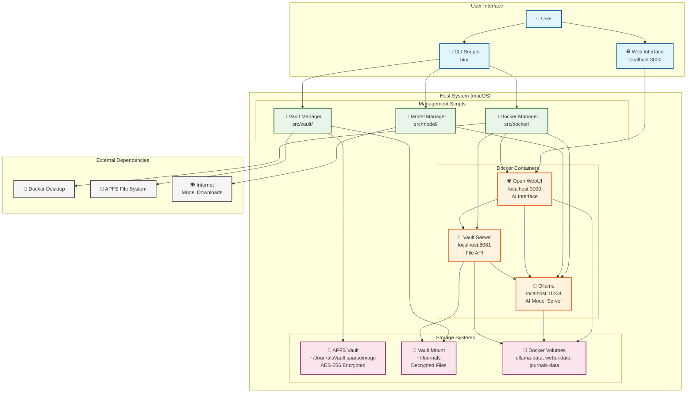

# Component Diagram

This document contains a simplified Mermaid diagram showing the component architecture and service locations of the Local Journal system.

## Component Overview

The Local Journal system consists of core components, containerized services, and storage systems that work together to provide secure AI-assisted journaling capabilities.

## Component Diagram

## Service Locations

### **Container Services (Docker)**
- **Ollama AI Server**: `localhost:11434` - Serves AI models locally
- **Open WebUI**: `localhost:3000` - Web interface for AI interaction  
- **Vault File Server**: `localhost:8081` - API for journal file access

### **Host Services (Bash Scripts)**
- **Vault Manager**: `src/vault/` - APFS vault operations (create, mount, unmount)
- **Docker Manager**: `src/docker/` - Container lifecycle management
- **Model Manager**: `src/model/` - Ollama model management and optimization

### **Storage Components**
- **APFS Sparse Image**: `~/JournalsVault.sparseimage` - Encrypted vault
- **Vault Mount Point**: `~/Journals` - Decrypted journal files
- **Docker Volumes**: Persistent container data storage

## Component Relationships

### **User Access**
- Users interact through CLI scripts or web interface
- CLI provides system management capabilities
- WebUI provides AI-assisted journaling interface

### **Service Dependencies**
- **Open WebUI** depends on **Ollama** for AI processing
- **Vault Server** provides file access to **Open WebUI**
- **Docker Manager** orchestrates all container services
- **Vault Manager** handles encrypted storage operations
- **Model Manager** manages AI model lifecycle

### **Storage Architecture**
- **APFS Vault** provides encrypted storage at rest
- **Vault Mount** provides decrypted file access
- **Docker Volumes** provide persistent container data
- **Vault Server** bridges container access to vault files

## Security Boundaries

- **Network**: All services bound to localhost only (127.0.0.1)
- **File System**: Journal files mounted read-only to AI containers
- **Encryption**: AES-256 encryption for all persistent storage
- **Isolation**: Docker containers with minimal privileges

This component diagram shows the essential architecture and service locations without the detailed operational processes, focusing on where components are located and how they connect.
