# System Architecture Diagram

This document contains a comprehensive Mermaid diagram that captures the system design of the Local Journal - Secure AI-Assisted Journaling project.

## System Overview

The Local Journal system is a privacy-first, local AI-assisted journaling infrastructure that provides encrypted storage with localhost-only AI services. The system is designed with security as the primary concern, ensuring complete privacy and data protection.

## Architecture Diagram

```mermaid
graph TB
    %% User Interface Layer
    subgraph "User Interface Layer"
        User[👤 User]
        CLI[📱 Command Line Interface]
        WebUI[🌐 Open WebUI Interface<br/>localhost:3000]
    end

    %% Session Control Layer
    subgraph "Session Control Layer"
        JournalsUp[📋 journals-up.sh<br/>Start Infrastructure]
        JournalsDown[📋 journals-down.sh<br/>Stop Infrastructure]
        JournalsStatus[📋 journals-status.sh<br/>Check Status]
        UXLib[📚 UX Enhancements Library]
    end

    %% Core System Components
    subgraph "Core System Components"
        subgraph "Vault Management System"
            VaultManager[🔐 vault-manager.sh<br/>APFS Vault Operations]
            VaultConfig[⚙️ vault.conf<br/>Configuration]
            VaultServer[📁 vault-file-server.py<br/>File Server API]
        end

        subgraph "Docker Orchestration"
            DockerManager[🐳 docker-manager.sh<br/>Container Management]
            DockerCompose[📋 docker-compose.yml<br/>Service Configuration]
            DockerConfig[⚙️ docker.conf<br/>Docker Settings]
        end

        subgraph "Model Management"
            ModelManager[🤖 model-manager.sh<br/>Ollama Integration]
            ModelConfig[⚙️ model.conf<br/>Model Settings]
            SecurityManager[🛡️ security-manager.sh<br/>Security Controls]
        end
    end

    %% Container Services
    subgraph "Container Services"
        subgraph "AI Services"
            Ollama[🧠 Ollama Container<br/>AI Model Server<br/>localhost:11434]
            OpenWebUI[🌐 Open WebUI Container<br/>AI Interface<br/>localhost:3000]
        end
        
        subgraph "Security Services"
            VaultFileServer[📁 Vault File Server<br/>localhost:8081]
            SecurityMonitor[🔍 Security Monitor]
            WriteMonitor[✍️ Write Monitor]
        end
    end

    %% Storage Layer
    subgraph "Storage Layer"
        subgraph "Encrypted Storage"
            APFSVault[🔐 APFS Sparse Image<br/>AES-256 Encrypted<br/>~/JournalsVault.sparseimage]
            VaultMount[📂 Vault Mount Point<br/>~/Journals]
        end
        
        subgraph "Docker Volumes"
            OllamaData[💾 Ollama Data Volume<br/>Model Storage]
            WebUIData[💾 WebUI Data Volume<br/>Session Data]
            JournalsData[📚 Journals Data Volume<br/>Read-Only Journal Access]
        end
    end

    %% Security & Monitoring
    subgraph "Security & Monitoring"
        SecurityValidation[🔒 Security Validation<br/>Port Binding Checks]
        ContainerSecurity[🛡️ Container Security<br/>Non-root Users]
        NetworkIsolation[🌐 Network Isolation<br/>Localhost Only]
        AuditLogs[📊 Audit Logs<br/>Security Events]
    end

    %% External Dependencies
    subgraph "External Dependencies"
        Docker[🐳 Docker Desktop<br/>Container Runtime]
        APFS[💽 APFS File System<br/>macOS Native Encryption]
        Internet[🌍 Internet<br/>Model Downloads Only]
    end

    %% User Interactions
    User --> CLI
    User --> WebUI
    CLI --> JournalsUp
    CLI --> JournalsDown
    CLI --> JournalsStatus

    %% Session Control Flow
    JournalsUp --> VaultManager
    JournalsUp --> DockerManager
    JournalsUp --> ModelManager
    JournalsUp --> UXLib

    %% Vault Management Flow
    VaultManager --> VaultConfig
    VaultManager --> APFSVault
    VaultManager --> VaultMount
    VaultFileServer --> VaultMount

    %% Docker Orchestration Flow
    DockerManager --> DockerCompose
    DockerManager --> DockerConfig
    DockerCompose --> Ollama
    DockerCompose --> OpenWebUI
    DockerCompose --> VaultFileServer

    %% Model Management Flow
    ModelManager --> ModelConfig
    ModelManager --> SecurityManager
    ModelManager --> Ollama
    SecurityManager --> SecurityValidation

    %% Container Dependencies
    OpenWebUI --> Ollama
    VaultFileServer --> Ollama
    OpenWebUI --> JournalsData
    Ollama --> JournalsData
    VaultFileServer --> JournalsData

    %% Volume Mappings
    Ollama --> OllamaData
    OpenWebUI --> WebUIData
    JournalsData --> VaultMount

    %% Security Controls
    SecurityValidation --> NetworkIsolation
    SecurityValidation --> ContainerSecurity
    SecurityManager --> AuditLogs
    DockerManager --> SecurityMonitor
    DockerManager --> WriteMonitor

    %% External Dependencies
    DockerManager --> Docker
    VaultManager --> APFS
    ModelManager --> Internet

    %% Styling
    classDef userInterface fill:#e1f5fe,stroke:#01579b,stroke-width:2px
    classDef sessionControl fill:#f3e5f5,stroke:#4a148c,stroke-width:2px
    classDef coreSystem fill:#e8f5e8,stroke:#1b5e20,stroke-width:2px
    classDef containers fill:#fff3e0,stroke:#e65100,stroke-width:2px
    classDef storage fill:#fce4ec,stroke:#880e4f,stroke-width:2px
    classDef security fill:#ffebee,stroke:#c62828,stroke-width:2px
    classDef external fill:#f5f5f5,stroke:#424242,stroke-width:2px

    class User,CLI,WebUI userInterface
    class JournalsUp,JournalsDown,JournalsStatus,UXLib sessionControl
    class VaultManager,VaultConfig,VaultServer,DockerManager,DockerCompose,DockerConfig,ModelManager,ModelConfig,SecurityManager coreSystem
    class Ollama,OpenWebUI,VaultFileServer,SecurityMonitor,WriteMonitor containers
    class APFSVault,VaultMount,OllamaData,WebUIData,JournalsData storage
    class SecurityValidation,ContainerSecurity,NetworkIsolation,AuditLogs security
    class Docker,APFS,Internet external
```

## Key Architecture Principles

### 1. Security by Design
- **AES-256 Encryption**: All journal data encrypted at rest using APFS sparse images
- **Localhost-Only Services**: All AI services bound to 127.0.0.1 only
- **Read-Only AI Access**: AI can read but never modify journal files
- **Interactive Passphrases**: No passphrase storage or logging

### 2. Privacy First
- **Complete Local Operation**: No external data transmission
- **Ephemeral AI Processing**: AI processes data in memory only
- **No Credential Storage**: All authentication is interactive

### 3. Modular Design
- **Clear Separation of Concerns**: Vault, Docker, and Model management are separate
- **Atomic Operations**: Each component can be operated independently
- **Comprehensive Error Handling**: Rollback capability for all operations

### 4. Operational Simplicity
- **One-Command Startup**: `./bin/journals-up.sh`
- **Clean Shutdown**: `./bin/journals-down.sh`
- **Status Monitoring**: `./bin/journals-status.sh`

## Component Descriptions

### User Interface Layer
- **Command Line Interface**: Bash scripts for system control
- **Open WebUI**: Web-based AI interface for journal interaction

### Session Control Layer
- **journals-up.sh**: Orchestrates complete system startup
- **journals-down.sh**: Graceful system shutdown
- **journals-status.sh**: System health monitoring

### Core System Components
- **Vault Management**: APFS encrypted storage operations
- **Docker Orchestration**: Container lifecycle management
- **Model Management**: Ollama AI model integration

### Container Services
- **Ollama**: Local AI model serving (localhost:11434)
- **Open WebUI**: AI interface (localhost:3000)
- **Vault File Server**: Journal file access API (localhost:8081)

### Storage Layer
- **APFS Sparse Image**: Encrypted vault storage
- **Docker Volumes**: Persistent container data
- **Read-Only Journal Access**: Secure file sharing

### Security & Monitoring
- **Security Validation**: Port binding and access control verification
- **Container Security**: Non-root users and privilege restrictions
- **Network Isolation**: Localhost-only service binding
- **Audit Logging**: Security event tracking

## Data Flow

1. **User starts system** → `journals-up.sh`
2. **Vault mounting** → Interactive passphrase entry → APFS mount
3. **Docker startup** → Container orchestration → Service health checks
4. **Model management** → Ollama model loading → Performance optimization
5. **WebUI access** → User interacts with AI → Journal file access (read-only)

## Security Boundaries

- **Network**: All services bound to localhost only
- **File System**: Journal files mounted read-only to AI containers
- **Process**: Non-root container execution with minimal privileges
- **Data**: AES-256 encryption for all persistent storage
- **Authentication**: Interactive passphrase entry with no storage

This architecture ensures complete privacy while providing powerful AI-assisted journaling capabilities in a secure, local environment.
